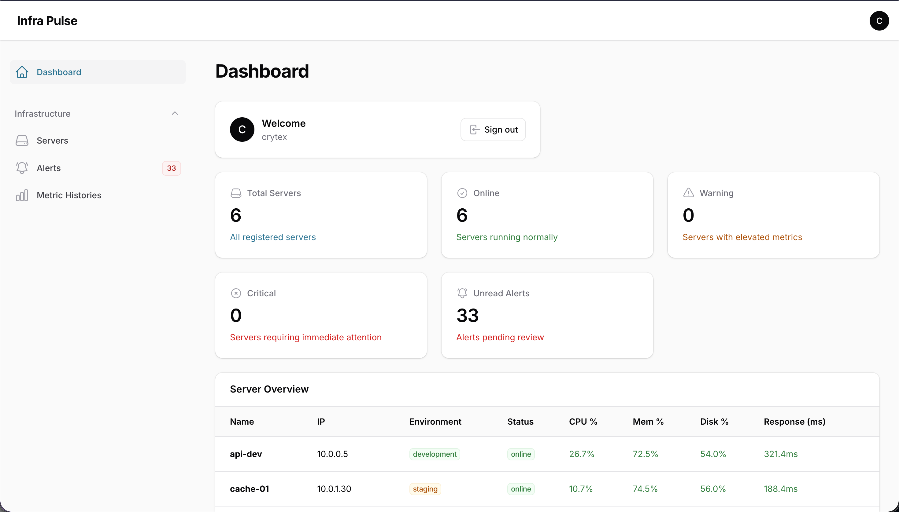
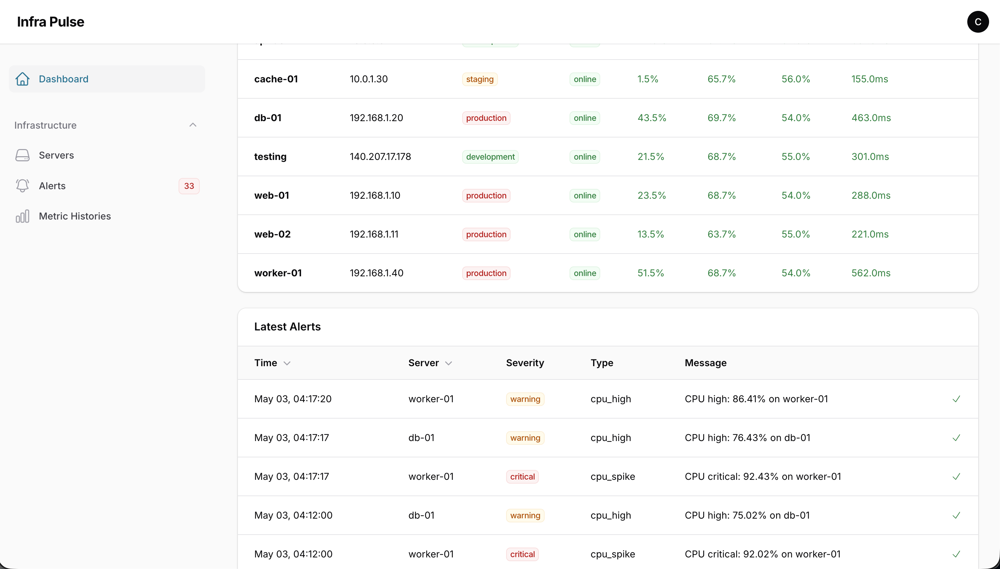
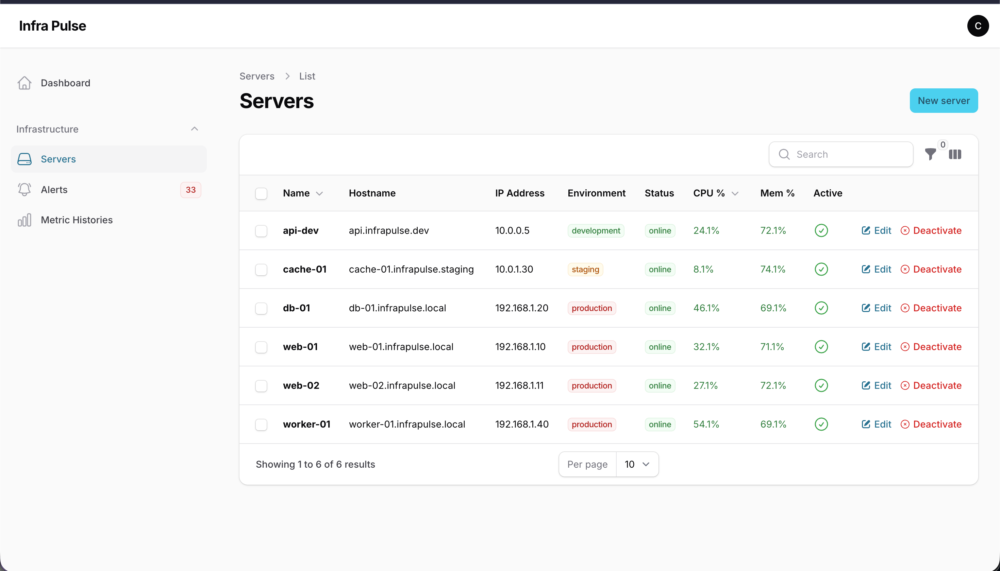
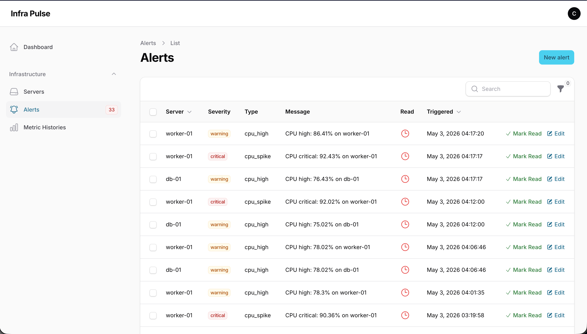
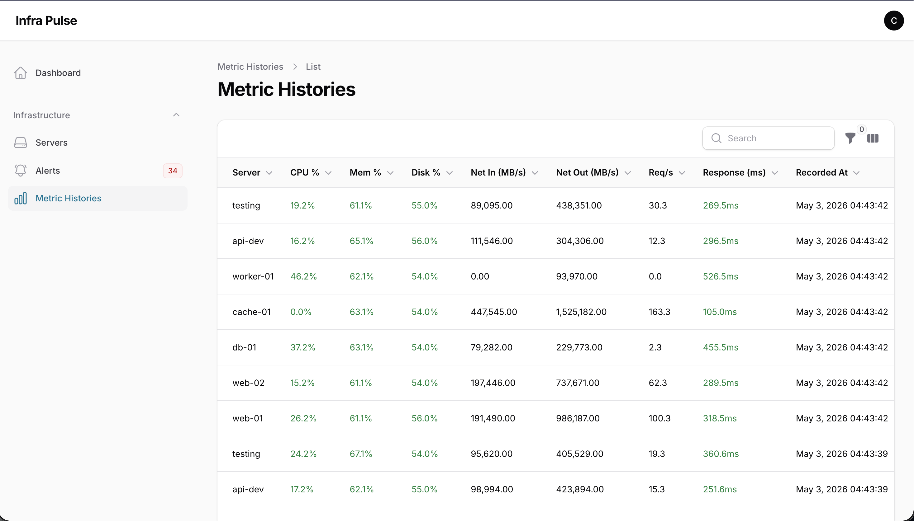
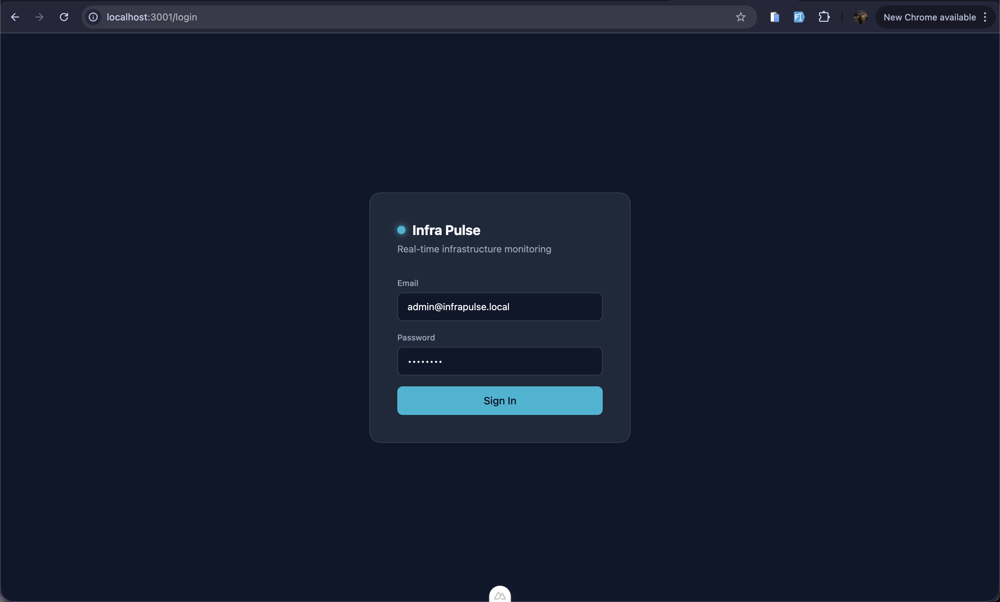
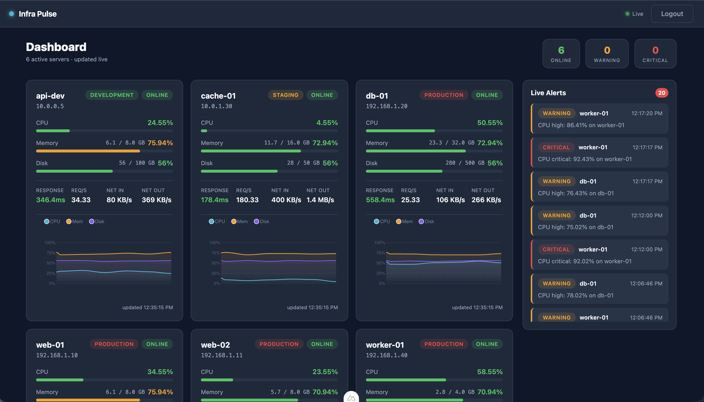

# Infra Pulse

Real-time server infrastructure monitoring dashboard. Built as a portfolio project to demonstrate WebSockets done properly in a Laravel + Nuxt stack.

## Features

- **Live metric streaming** — CPU, memory, disk, network, request rate, and response time update every ~3 seconds via WebSockets (Laravel Reverb + Laravel Echo)
- **Server status tracking** — cards transition between Online / Warning / Critical states automatically based on thresholds
- **Live alert feed** — warnings and critical alerts appear in real time with slide-in transitions
- **Sparkline charts** — 30-point rolling history per server rendered with ApexCharts
- **Filament admin panel** — manage servers, view historical metrics, mark alerts read
- **Token-based auth** — Sanctum personal access tokens, Bearer header on every API call
- **Multi-environment** — production, staging, and development servers with distinct badge styling

## Tech Stack

| Layer | Technology |
|---|---|
| Backend | Laravel 12 |
| Admin Panel | Filament v5 |
| WebSockets | Laravel Reverb v1.10 |
| Frontend | Nuxt 4 + Vue 3 + TypeScript |
| Charts | ApexCharts (vue3-apexcharts) |
| Auth | Laravel Sanctum (token mode) |
| Database | PostgreSQL (via Herd) |
| Runtime | Bun (frontend), PHP 8.3 (backend) |

## Setup

### Prerequisites

- PHP 8.3+, Composer
- Bun
- Laravel Herd (or a local PostgreSQL instance)

### Backend

```bash
composer install
cp .env.example .env
php artisan key:generate

# Configure .env:
# DB_CONNECTION=pgsql
# DB_DATABASE=infra-pulse
# APP_NAME="Infra Pulse"
# REVERB_HOST=localhost
# REVERB_PORT=8080

php artisan migrate
php artisan db:seed
```

### Frontend

```bash
cd frontend
bun install
cp .env.example .env
# Set NUXT_PUBLIC_API_URL=https://infra-pulse.test
# Set NUXT_PUBLIC_REVERB_HOST=localhost
```

### Run

```bash
# Terminal 1 — WebSocket server
php artisan reverb:start

# Terminal 2 — Metric generator (loops every 3s)
php artisan metrics:generate --loop

# Terminal 3 — Frontend dev server
cd frontend && bun dev
```

- **Frontend**: http://localhost:3001
- **Admin panel**: https://infra-pulse.test/admin

**Demo credentials**: `admin@infrapulse.local` / `password`

## Demo Servers

| Server | Environment | Profile |
|---|---|---|
| web-01 | production | Stable web traffic, moderate CPU |
| web-02 | production | Lighter load, secondary node |
| db-01 | production | High memory, elevated disk (76%) |
| cache-01 | staging | Low CPU, high request rate |
| worker-01 | production | High CPU baseline — frequently hits Warning |
| api-dev | development | Erratic CPU spikes — simulates dev instability |

## Alert Thresholds

| Metric | Warning | Critical |
|---|---|---|
| CPU | ≥ 75% | ≥ 90% |
| Memory | — | ≥ 90% |
| Disk | ≥ 85% | — |
| Response Time | ≥ 1000ms | — |

Alerts are throttled — the same alert type per server fires at most once per 5 minutes.

## Architecture Notes

- **No SSR on dashboard** — `ssr: false` in `nuxt.config.ts` because Node.js doesn't trust Herd's self-signed SSL cert; server-side `fetchUser()` fails and redirects to login on every refresh
- **Reverb host must be `localhost`** — Reverb validates the WebSocket `Host` header; custom `.test` domains are rejected
- **Token auth, not cookie/SPA** — cross-origin between `localhost:3001` and `infra-pulse.test` means session cookies don't work
- **`Broadcast::routes` with `auth:sanctum`** — must be registered manually in `bootstrap/app.php`; the default `withRouting(channels:)` uses `web` middleware (session-based), which rejects Bearer tokens with 403
- **`broadcastAs()` required** — without it Laravel broadcasts `App\Events\ClassName`; Echo's `.EventName` listener only matches the short name and events are silently dropped

## Screenshot

 

 

 

 

 

 

 
