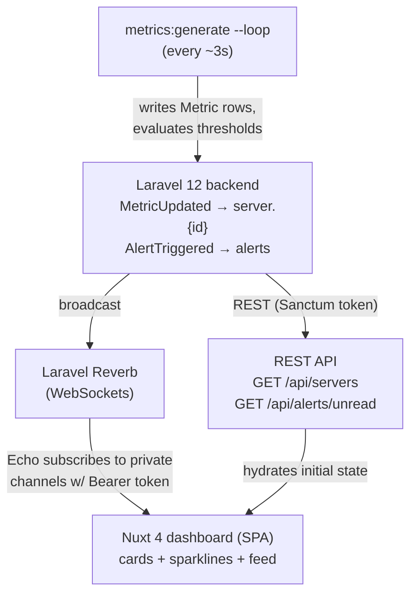

# Infra Pulse

> Real-time server infrastructure monitoring dashboard. Built as a portfolio project to demonstrate WebSockets done properly in a Laravel + Nuxt stack.


## Preview

| Backend Dashboard | Backend Dashboard | Backend Servers |
|---|---|---|
|  |  |  |

| Alerts | Histories | Login |
|---|---|---|
|  |  |  |


## About

Infra Pulse streams live server health metrics — CPU, memory, disk, network, request rate, and response time — to a dashboard that updates every ~3 seconds over WebSockets. Servers transition between Online / Warning / Critical states based on configurable thresholds, and breaches surface in a live alert feed.

The goal was less about building a "real" monitoring product and more about doing real-time right end to end: a Laravel backend broadcasting over Reverb, token-authenticated channels, and a Nuxt frontend consuming events through Laravel Echo — with all the cross-origin and broadcasting gotchas that come with it.

## Features

- **Live metric streaming** — CPU, memory, disk, network, request rate, and response time update every ~3 seconds via WebSockets (Laravel Reverb + Laravel Echo)
- **Server status tracking** — cards transition between Online / Warning / Critical states automatically based on thresholds
- **Live alert feed** — warnings and critical alerts appear in real time with slide-in transitions
- **Sparkline charts** — 30-point rolling history per server rendered with ApexCharts
- **Filament admin panel** — manage servers, view historical metrics, mark alerts read
- **Token-based auth** — Sanctum personal access tokens, Bearer header on every API call
- **Multi-environment** — production, staging, and development servers with distinct badge styling

## Tech Stack

| Layer | Technology |
|---|---|
| Backend | Laravel 12 |
| Admin Panel | Filament v5 |
| WebSockets | Laravel Reverb v1.10 |
| Frontend | Nuxt 4 + Vue 3 + TypeScript |
| Charts | ApexCharts (vue3-apexcharts) |
| Auth | Laravel Sanctum (token mode) |
| Database | PostgreSQL (via Herd) |
| Runtime | Bun (frontend), PHP 8.3 (backend) |

## System Flow



1. `metrics:generate --loop` writes a new `Metric` row per server every ~3s and evaluates alert thresholds.
2. The backend broadcasts `MetricUpdated` on `server.{id}` and `AlertTriggered` on `alerts`.
3. Reverb pushes those events to subscribed clients; Echo authenticates the private channels with a Sanctum Bearer token.
4. The Nuxt SPA updates the relevant server card / sparkline and prepends new alerts to the feed. Initial state is hydrated via the REST endpoints.

## Database Overview

**servers**

| Column | Type | Notes |
|---|---|---|
| id | bigint | PK |
| name | string | |
| hostname | string | |
| ip_address | string | |
| environment | string | default `production` |
| status | enum | `online` / `warning` / `critical` / `offline` |
| description | text | nullable |
| is_active | boolean | default `true` |
| timestamps | | |

**metrics** — `server_id` → servers (cascade on delete)

| Column | Type |
|---|---|
| id | bigint (PK) |
| server_id | FK → servers |
| cpu_usage | float |
| memory_usage | float |
| memory_used / memory_total | unsigned bigint |
| disk_usage | float |
| disk_used / disk_total | unsigned bigint |
| network_in / network_out | float |
| request_rate | float |
| response_time | float |
| timestamps | |

**alerts** — `server_id` → servers (cascade on delete)

| Column | Type | Notes |
|---|---|---|
| id | bigint | PK |
| server_id | FK → servers | |
| type | string | e.g. `cpu`, `memory`, `disk` |
| message | string | |
| severity | enum | `info` / `warning` / `critical`, default `warning` |
| is_read | boolean | default `false` |
| triggered_at | timestamp | |
| timestamps | | |

### Alert Thresholds

| Metric | Warning | Critical |
|---|---|---|
| CPU | ≥ 75% | ≥ 90% |
| Memory | — | ≥ 90% |
| Disk | ≥ 85% | — |
| Response Time | ≥ 1000ms | — |

Alerts are throttled — the same alert type per server fires at most once per 5 minutes.

## API Endpoints

All endpoints are JSON. Authenticated routes require an `Authorization: Bearer <token>` header.

| Method | Endpoint | Auth | Description |
|---|---|---|---|
| `POST` | `/api/login` | — | Validate credentials, return a Sanctum token + user |
| `POST` | `/api/logout` | Sanctum | Revoke the current access token |
| `GET` | `/api/user` | Sanctum | Return the authenticated user |
| `GET` | `/api/servers` | Sanctum | Active servers with their latest metric |
| `GET` | `/api/alerts/unread` | Sanctum | Up to 20 most recent unread alerts |

**Broadcast channels** (private, authorized via `auth:sanctum`):

| Channel | Event | Authorization |
|---|---|---|
| `server.{serverId}` | `MetricUpdated` | any authenticated user |
| `alerts` | `AlertTriggered` | any authenticated user |
| `App.Models.User.{id}` | — | owner only |

## Getting Started

### Prerequisites

- PHP 8.3+, Composer
- Bun
- Laravel Herd (or a local PostgreSQL instance)

### Backend

```bash
composer install
cp .env.example .env
php artisan key:generate

# Configure .env:
# DB_CONNECTION=pgsql
# DB_DATABASE=infra-pulse
# APP_NAME="Infra Pulse"
# REVERB_HOST=localhost
# REVERB_PORT=8080

php artisan migrate
php artisan db:seed
```

### Frontend

```bash
cd frontend
bun install
cp .env.example .env
# Set NUXT_PUBLIC_API_URL=https://infra-pulse.test
# Set NUXT_PUBLIC_REVERB_HOST=localhost
```

### Run

```bash
# Terminal 1 — WebSocket server
php artisan reverb:start

# Terminal 2 — Metric generator (loops every 3s)
php artisan metrics:generate --loop

# Terminal 3 — Frontend dev server
cd frontend && bun dev
```

- **Frontend**: http://localhost:3001
- **Admin panel**: https://infra-pulse.test/admin

**Demo credentials**: `admin@infrapulse.local` / `password`

#### Demo Servers

| Server | Environment | Profile |
|---|---|---|
| web-01 | production | Stable web traffic, moderate CPU |
| web-02 | production | Lighter load, secondary node |
| db-01 | production | High memory, elevated disk (76%) |
| cache-01 | staging | Low CPU, high request rate |
| worker-01 | production | High CPU baseline — frequently hits Warning |
| api-dev | development | Erratic CPU spikes — simulates dev instability |

## What I Learned

- **No SSR on dashboard** — `ssr: false` in `nuxt.config.ts` because Node.js doesn't trust Herd's self-signed SSL cert; server-side `fetchUser()` fails and redirects to login on every refresh
- **Reverb host must be `localhost`** — Reverb validates the WebSocket `Host` header; custom `.test` domains are rejected
- **Token auth, not cookie/SPA** — cross-origin between `localhost:3001` and `infra-pulse.test` means session cookies don't work
- **`Broadcast::routes` with `auth:sanctum`** — must be registered manually in `bootstrap/app.php`; the default `withRouting(channels:)` uses `web` middleware (session-based), which rejects Bearer tokens with 403
- **`broadcastAs()` required** — without it Laravel broadcasts `App\Events\ClassName`; Echo's `.EventName` listener only matches the short name and events are silently dropped

## Future Improvements

- Real agent-based metric collection (replace the simulated generator)
- Historical metric charts with selectable time ranges
- Configurable per-server alert thresholds via the admin panel
- Alert delivery channels (email / Slack / webhook)
- Multi-user access with roles and per-server permissions

## License

Built for learning and portfolio purposes by [syahmidev](https://www.syahmidev.com).
